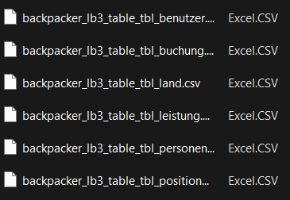
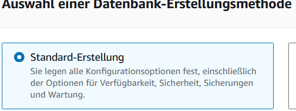
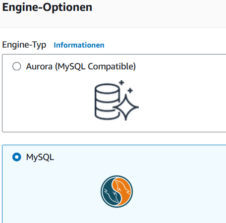
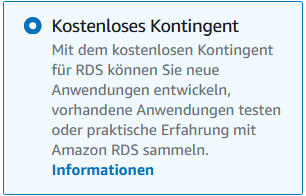
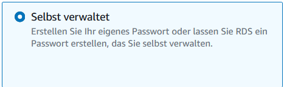
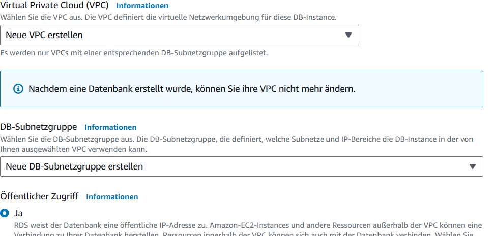
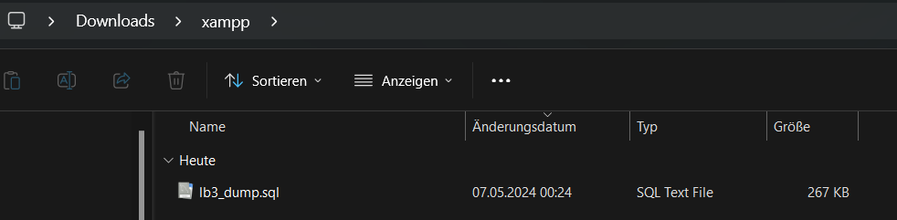

# Einleitung

Dieses MD beinhaltet den ablauf von Erstellung der DB bis zur Migrierung. Alles wird hier schritt für schritt erklärt. Alle dazugehörenden Skripte sind ebenfalls im Repository enthalten. 


## XAMPP

1. Im XAMPP war es mein erster schritt eine Lokale Datenbank zu erstellen. 

```sql
CREATE DATABASE lb3;
```
2. Dann habe ich damit begonnen die Datenbank mit dem vorgegebenen inhalt zu füllen.
    kopiere nun den Inhalt und füge es in deine Konsole ein.

[Link zur DB](https://gitlab.com/ch-tbz-it/Stud/m141/m141/-/blob/main/LB3-Praxisarbeit/backpacker_ddl_lb3.sql)

## Benutzergruppen

In diesem Abschnitt erstellen wir Benutzer & Benutzergruppen und fügen den Gruppen die jeweiligen Berechtigungen hinzu.

### Benutzergruppe 'Benutzer'

1. Zuerst erstellen wir einen Benutzer (name'benutzer')

```sql
CREATE USER 'benutzer'@'%' IDENTIFIED BY'password1';
```
2. Jetzt erstellen wir eine Rolle für die Gruppe 'Benutzer'.

```sql
CREATE ROLE benutzer_grp1;
```
3. Nun fügen wir Privilegien der Rolle hinzu.

```sql
GRANT SELECT, UPDATE ON lb3.tbl_personen TO benutzer_grp1;
GRANT SELECT (deaktiviert) ON lb3.tbl_benutzer TO benutzer_grp1;
GRANT SELECT, INSERT, UPDATE (aktiv, Benutzergruppe , Benutzername, erfasst, Name, Vorname) ON lb3.tbl_benutzer TO benutzer_grp1;
GRANT SELECT, INSERT, UPDATE, DELETE ON lb3.tbl_buchung TO benutzer_grp1;
GRANT SELECT, INSERT, UPDATE, DELETE ON lb3.tbl_positionen TO benutzer_grp1;
GRANT SELECT ON lb3.tbl_land TO benutzer_grp1;
GRANT SELECT ON lb3.tbl_leistung TO benutzer_grp1;
```
4. Füge nun die Rolle dem ensprechenden Benutzer hinzu.

```sql
GRANT benutzer_grp TO 'benutzer'@'%';
FLUSH PRIVILEGES;
```
### Benutzergruppe 'management'

1. Benutzer erstellen

```sql
CREATE USER 'management'@'%' IDENTIFIED BY'password1';
```

2. Rolle erstellen

```sql
CREATE ROLE management_grp;
```

3. Privillegien in Rolle einfügen

```sql
GRANT SELECT ON lb3.tbl_positionen TO management_grp;
GRANT SELECT ON lb3.tbl_buchung TO management_grp;
GRANT SELECT, INSERT, UPDATE, DELETE ON lb3.tbl_personen TO management_grp;
GRANT SELECT, INSERT, UPDATE, DELETE ON lb3.tbl_land TO management_grp;
GRANT SELECT, INSERT, UPDATE, DELETE ON lb3.tbl_leistung TO management_grp;
GRANT SELECT, INSERT, UPDATE, DELETE ON lb3.tbl_benutzer TO management_grp;
```

4. Füge Rolle dem benutzer 'management' hinzu 

```sql
GRANT management_grp TO 'management'@'%';
FLUSH PRIVILEGES;
```
## CSV Dateien Implementieren

Nun füllen wir unsere Tables mithilfe der Vorgegebenen Backpacker CSV Datei. 
[Link zum Backpacker](https://gitlab.com/ch-tbz-it/Stud/m141/m141/-/blob/main/LB3-Praxisarbeit/backpacker_lb3.csv.zip)

1. Extahiere die Datei und öffne sie.


2. Damit du die Dateien in die DB importien kannst, musst du Folgenden Befehl ausführen.

```sql
mysql --local-infile=1 -u root
```
3. Nun kopiere den Pfad und führe den folgenden befehl in deinem Terminal aus. Jede CSV Datei wird zum ensprechenden Table importiert.

```sql
LOAD DATA INFILE 'C:/Users/noah_/Desktop/CSV-dateien_lb3/backpacker_lb3.csv/backpacker_lb3_table_tbl_benutzer.csv'
INTO TABLE tbl_benutzer
FIELDS TERMINATED BY ','
ENCLOSED BY '"'
LINES TERMINATED BY '\n'
IGNORE 1 ROWS;
```
```sql
LOAD DATA INFILE 'C:/Users/noah_/Desktop/CSV-dateien_lb3/backpacker_lb3.csv/backpacker_lb3_table_tbl_buchung.csv'
INTO TABLE tbl_buchung
FIELDS TERMINATED BY ','
ENCLOSED BY '"'
LINES TERMINATED BY '\n'
IGNORE 1 ROWS;
``` 
```sql
LOAD DATA INFILE 'C:/Users/noah_/Desktop/CSV-dateien_lb3/backpacker_lb3.csv/backpacker_lb3_table_tbl_land.csv'
INTO TABLE tbl_land
FIELDS TERMINATED BY ','
ENCLOSED BY '"'
LINES TERMINATED BY '\n'
IGNORE 1 ROWS;
```
```sql
LOAD DATA INFILE 'C:/Users/noah_/Desktop/CSV-dateien_lb3/backpacker_lb3.csv/backpacker_lb3_table_tbl_leistung.csv'
INTO TABLE tbl_leistung
FIELDS TERMINATED BY ','
ENCLOSED BY '"'
LINES TERMINATED BY '\n'
IGNORE 1 ROWS;
```
```sql
LOAD DATA INFILE 'C:/Users/noah_/Desktop/CSV-dateien_lb3/backpacker_lb3.csv/backpacker_lb3_table_tbl_personen.csv'
INTO TABLE tbl_personen
FIELDS TERMINATED BY ','
ENCLOSED BY '"'
LINES TERMINATED BY '\n'
IGNORE 1 ROWS;
```
```sql
LOAD DATA INFILE 'C:/Users/noah_/Desktop/CSV-dateien_lb3/backpacker_lb3.csv/backpacker_lb3_table_tbl_positionen.csv'
INTO TABLE tbl_positionen
FIELDS TERMINATED BY ','
ENCLOSED BY '"'
LINES TERMINATED BY '\n'
IGNORE 1 ROWS;
```

## AWS 

Nun kommen wir zur erstellung der Cloud Datenbank

1. Öffne Services und gehe aud RDS. Klicke auf 'Erstelle Datenbank' und mache folgende KOnfigurationen. Verändere nur das was auf den Bildern gezeigt wird





Vorlagen


Passwort selber wählen


Neues VPC ertsellen (&namen geben), neue Subnetzgruppe, Öffentlicher Zugriff


2. Nun hast du deine Datenbank erstellt. Jetzt verbinden wir uns auf diese. Dazu kopierst du den Endpunkt, und füge ihn ensprechend ein. Gehe nun auf XAMPP öffne eine shell und füre diesen befehl aus. 

```sql
mysql -h (endpunkt) -u admin -p
```

3. Jetzt erstellst du eine neue Datenbank 

```sql
CREATE DATABASE new_database;
```

## Migration 

Nun werden wir schritt für schritt die Lokale datenbank auf die Cloud migriern. 

1. Führe den befehl auf deiner Lokalen DB aus.

```
mysqldump -u username -p database_name > data-dump.sql
``` 
2. diesen Dump findest du dan in deinem Downloads Ordner. Führe nun diesen befehl auf deiner Cloud aus. 



```sql
mysql -h (endpunkt) -u username -p new_database < data-dump.sql
```

3. Mit folgendem Befehl testest du ob der Dump funktioniert hat.

```sql
Show tables;
```

## Testphase

Jetzt finden wir heraus ob alles so geklappt hat wir wir es wollten oder nicht.

1. User Berrechtigungen testen. mit Config


